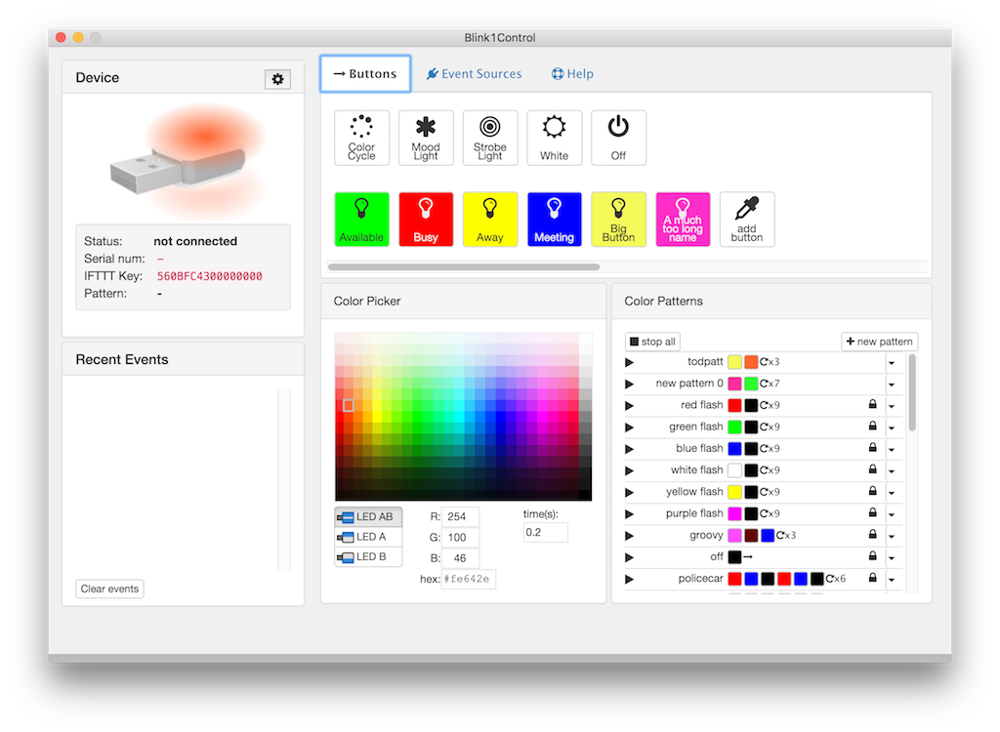
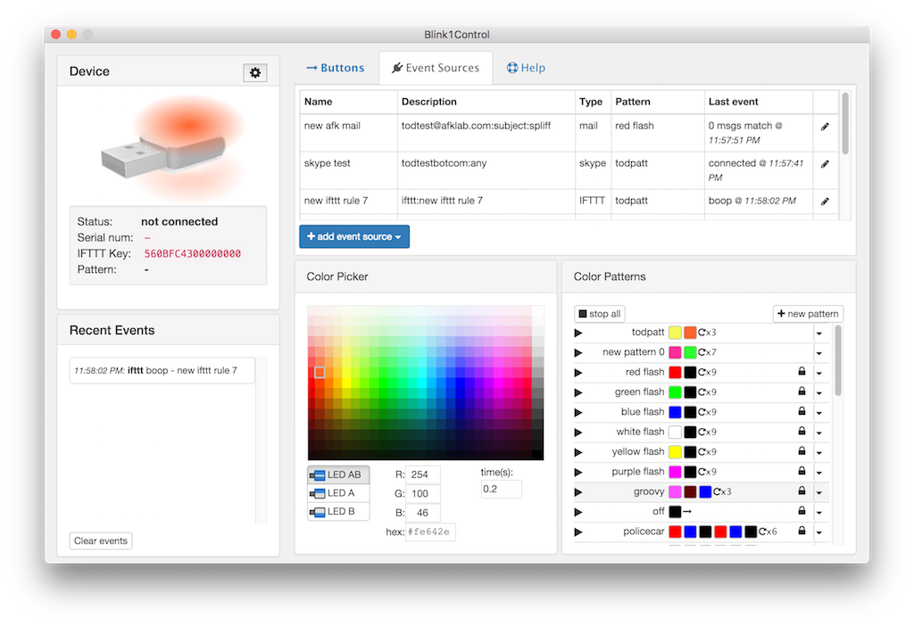

# Blink1Control2

Blink1Control written in ElectronJs, ReactJs and NodeJs.




See [NOTES.md](NOTES.md) for more info.

### Setup steps (for development)

```
$ npm install
$ ./node_modules/.bin/electron-rebuild
$ npm run watch &
$ npm run start
```

### Build steps (for production)

#### Mac OS X:


```
$ npm install
$ npm build-osx

```

#### Windows:

```
$ npm install
$ npm build-win
```
