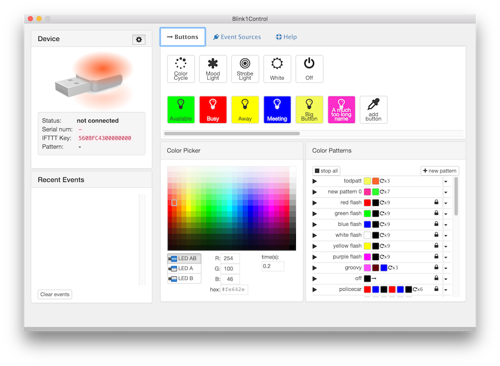
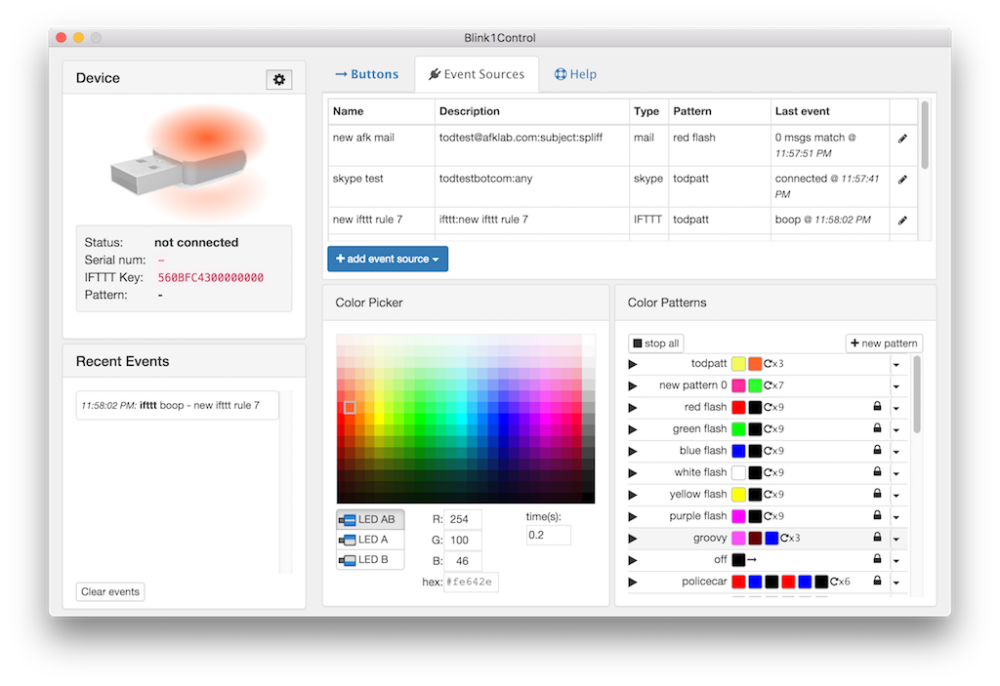

# Blink1Control2

Blink1Control2 is the desktop application for controlling and hooking events to blink(1). It is the primary user-level application for controlling blink(1). It is an event-based system for triggering blink(1) color patterns. Those events can be on your computer or on the Net.




### Features

- **Event-driven color patterns** — define named color sequences and trigger them from any event source
- **Multiple event sources** — IFTTT webhooks, email/IMAP monitoring, MQTT, time-based alarms, and custom scripts
- **REST API** — local HTTP API on port 8934 lets any app, script, or automation tool control the blink(1); `curl http://localhost:8934/blink1/red` is all it takes
- **Multiple blink(1) devices** — address each device individually by serial number
- **System tray / menu bar** — runs quietly in the background; patterns play even when the window is closed
- **Cross-platform** — Mac, Windows, Linux x86, and Raspberry Pi

### Downloads
There are pre-built app downloads for Mac OS X, Windows, Linux, and Raspberry Pi in the [releases area](https://github.com/todbot/Blink1Control2/releases).

* [Download for Mac, Windows, Linux x86, and RaspberryPi](https://github.com/todbot/Blink1Control2/releases)

### Setup steps (for development)

You will need a working C compiler setup for Node projects.
You can find details for that here:
https://github.com/node-hid/node-hid#compiling-from-source

Start a hot-reloading content server and the application:
```
npm install
npm run watch &
npm run startdev
```

Or to emulate a production run:
```
npm install        # installs all dependencies locally
npm run webpack    # packs app, there will be some warnings, ignore
npm run start      # starts the packaged app
npm run dist:draft # create relocatable app and installer(s), in "dist" dir
```

#### Linux:

Install udev rules file in `/etc/udev/rules.d/51-blink1.rules` with contents:
```
SUBSYSTEM=="input", GROUP="input", MODE="0666"
SUBSYSTEM=="usb", ATTRS{idVendor}=="27b8", ATTRS{idProduct}=="01ed", MODE:="666", GROUP="plugdev"
KERNEL=="hidraw*", ATTRS{idVendor}=="27b8", ATTRS{idProduct}=="01ed", MODE="0666", GROUP="plugdev"
```
And install the rules with:
```
sudo udevadm control --reload-rules
```
Then unplug and replug the blink(1) device.

You may need to install the following pre-requisites, depending on your distro:

```sh
sudo apt install pkg-config libgnome-keyring-dev icnsutils xz-utils rpm bsdtar libusb-1.0-0-dev libudev-dev
```

#### Raspberry Pi

As above for Linux, with a bit extra:

```sh
sudo apt install --no-install-recommends -y ruby-full bsdtar rpm libopenjp2-tools
sudo gem install fpm -v 1.10.1
export USE_SYSTEM_FPM="true"
npm install
npm run dist:raspi
```

### node-blink1-server

The blink(1) device control and REST API layer is factored out into a standalone package called **[node-blink1-server](https://www.npmjs.com/package/node-blink1-server)**, which lives in `packages/node-blink1-server/` in this repo.

Blink1Control2 uses it internally, but it can also be run on its own — useful for NodeJs-based headless setups (Raspberry Pi, servers) where you want HTTP control of blink(1) without the full desktop app.
(For another headless server, check out the C-based [`blink1-tiny-server`](https://github.com/todbot/blink1-tool/blob/main/server/README.md) that's part of [`blink1-tool` repo](https://github.com/todbot/blink1-tool/))

```
npx node-blink1-server           # no install required, starts on port 8934
npx node-blink1-server 8080      # custom port
```

See the [node-blink1-server README](packages/node-blink1-server/README.md) for full documentation.

### Other info
- [Publishing.md](Publishing.md) for info on publishing binaries
- [NOTES.md](NOTES.md) for random behind-the-scenes thoughts
