# Blink1Control2 Manual

Blink1Control2 is a GUI application for hooking notification events to blink(1) devices. It is the primary application for controlling blink(1). These notification events can be on your computer or on the Net, and these events trigger colors or color patterns to be played on the blink(1) device.

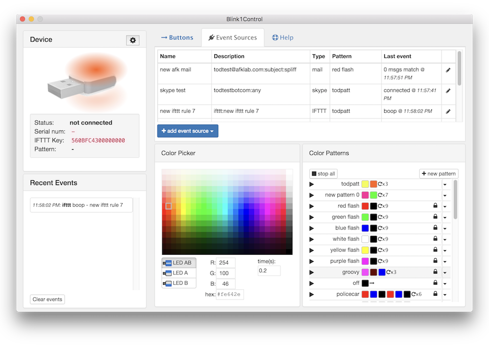

## Blink1Control2 Features

- Full 24-bit control of both top and bottom RGB LEDs of blink(1) devices
- Control up to 8 different blink(1) devices
- Create custom "Big Buttons" to easily set Presence (Away/Busy/Meeting) or play favorite color patterns
- Event source notification system connects IFTTT, Mail, scripts, and more to blink(1) color patterns
- Create and use on-the-fly "meta-pattern" color patterns in any event source
- Entirely open-source

## In this Manual

- Overview
- Installation
  - Installing the blink(1) hardware
  - Installing the Blink1Control2 software
  - Running Blink1Control2 (and quitting)
- Device Information
  - Device Status
  - Serial number and IFTTT Key
  - Multiple blink(1) display
  - Preferences
- Big Buttons
- Color Picker
- Color Patterns
  - Patterns in general
  - Editing patterns
  - Meta-patterns
- Event Sources
  - IFTTT
  - Email
  - File / Scripts / URLs
- Recent Events
- Tray Menu
- Preferences
  - Start at login
  - Start minimized
  - Pattern play serialize
  - Enable API server
  - Allow multi blink(1) devices in rules
- Configuration File

## 1. Overview

The blink(1) is a small USB device with two independently-addressable RGB LEDs and a tiny computer that runs a color mixing and color pattern state machine. It is designed to be unobtrusive yet can be very bright when lit to get your attention.

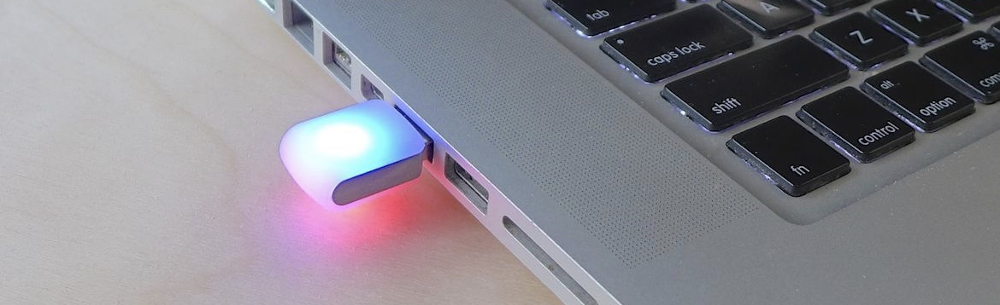

While blink(1) requires no drivers (thanks to it being a HID-class USB device), it does need a program to control it. Blink1Control2 is the primary GUI-based program designed to be used with blink(1) devices. It acts as a conduit to blink(1), looking for events you tell it you want to be notified about and controlling the blink(1) hardware.

The Blink1Control2 application can natively receive events from:

- IFTTT channels (more than 300 and counting, and all free to use!)
- IMAP and GMAIL email services
- Files or URLs containing text or JSON data structs
- Executable programs or scripts that emit text or JSON data structs

The Blink1Control2 application uses these events to trigger colors or color patterns on the blink(1). The application can independently control both LEDs in a blink(1) device and multiple blink(1) devices are supported, allowing you to assign different events to different devices.

### 1.1 How Blink1Control2 works

Events trigger color patterns, color patterns change blink(1):

```
Event Source --> Color Pattern plays --> blink(1) changes color
```

## 2. Installation

### 2.1 Installing the blink(1) hardware

To install the blink(1) hardware, just plug in the blink(1) device into any open USB port. No driver installation required! On Windows, you will see it say "installing hardware" but it's not actually doing anything.

### 2.2 Installing the Blink1Control2 software

The Blink1Control2 software comes as either a zip bundle for installation in any directory you want, or a DMG (Mac) or EXE (Windows) installer for system-wide installation.

### 2.3 Running Blink1Control2 (and quitting)

Once you have the application installed how you like it, double-click its application icon to launch it. It will open up its main window (see first screenshot) and auto-detect any blink(1) devices that are plugged in.

**Note:** Closing the Blink1Control2 window will not quit the app, just hides it. You can access it again via its Menu Bar / System Tray Menu. This is also how you quit Blink1Control2 (see Section 9 "Tray Menu").

## 3. Device Information

The Device Information panel in Blink1Control2 is the first area you should look at when running Blink1Control. It consists of a "virtual blink(1)" that mirrors the colors displayed on a real blink(1) if present and a status area that includes information about device connection, its serial number and the IFTTT key used with [IFTTT.com](http://ifttt.com).

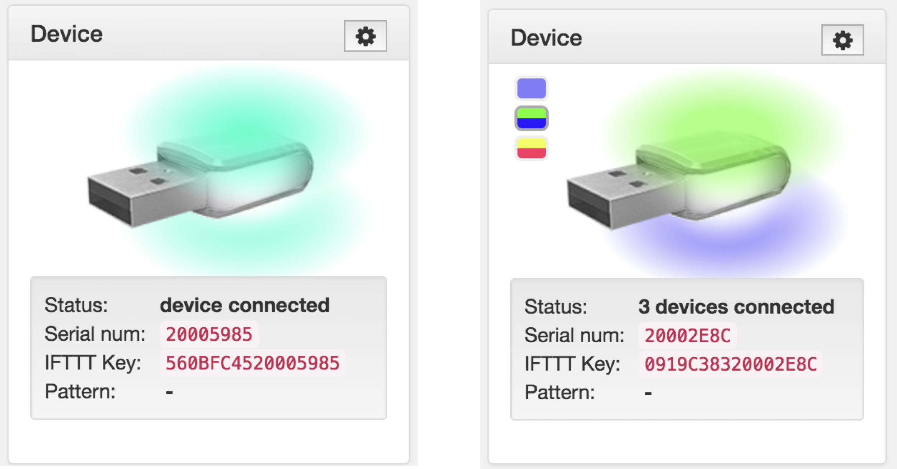

### 3.1 Device Status

The "Status" field indicates how many blink(1) devices Blink1Control2 can see and has control of.

**Note:** Once Blink1Control2 sees a blink(1) device, that device cannot be used by other programs that access the device directly (like the command-line program "blink1-tool").

### 3.2 Serial number and IFTTT key

The serial number field is the 8-hexdigit serial number of the primary (highest numbered) blink(1) device plugged into the system. Every blink(1) ships with a unique serial number. This allows you to easily and repeatably address a specific blink(1), as well as provide a unique identifier to online services such as IFTTT.

The **IFTTT key** is a 16-hexdigit identifier composed of a 8-hexdigit "Host Id" and the 8-hexdigit blink(1) serial number. The Host Id is randomly generated and if you would like the same Host Id so you can use the same blink(1) on multiple computers, you can edit the "hostId" value to match.

When activating the IFTTT blink(1) channel, you will be asked for the IFTTT Key — copy and paste the key from Blink1Control2 to IFTTT.

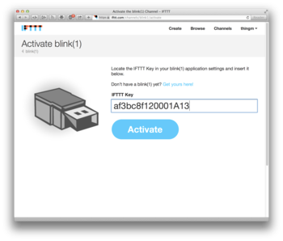

**Note:** The "hostId" config value is in the config file "blink1control-config.json". The path to the config file is available in the "About" menu. For more details, see Section 11 "Configuration file".

### 3.3 Multiple blink(1) display

If you have multiple blink(1) devices plugged in, colored icons for each blink(1) will be displayed to the left of the primary blink(1) image. These icons mirror the color state of the blink(1) devices.

To see the serial number of the non-primary blink(1)s, hover over the color spots with the mouse cursor to see detailed info about each blink(1).

With multiple blink(1)s installed, event sources can now be configured to use a specific blink(1).

**Note:** Blink1Control2 only does a full USB rescan on application startup or if there are no devices plugged in. If you plug in an additional blink(1) with one already plugged in, please restart the application.

### 3.4 Preferences (gear icon)

This panel also includes a gear icon button to bring up more advanced Preferences. For more information, see Section 10 "Preferences".

## 5. Big Buttons

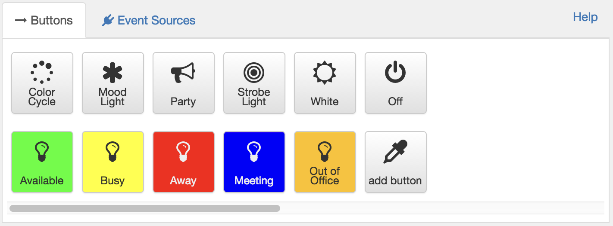

When Blink1Control is started, you are most notably presented with a collection of big buttons that we call "Big Buttons". These buttons are in two groups: an upper set of demos & tools to play around with blink(1), and a lower set of customizable buttons that come pre-configured for common presence indications like "Away", "Busy" or "Meeting". These Big Buttons can be assigned any color or color pattern.

Right-click on an existing button to edit its parameters.

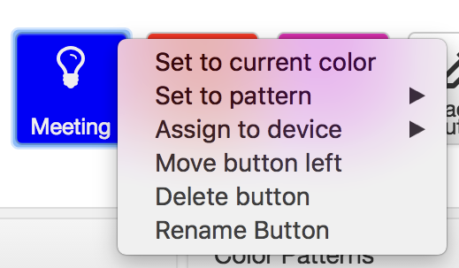

## 6. Color Picker

The Blink1Control2 color picker lets you select colors via a color grid, a hex string text field, or a red/green/blue numbers. Changing the color in any way using the color picker will also change the color on the blink(1), to let you easily try out new colors.

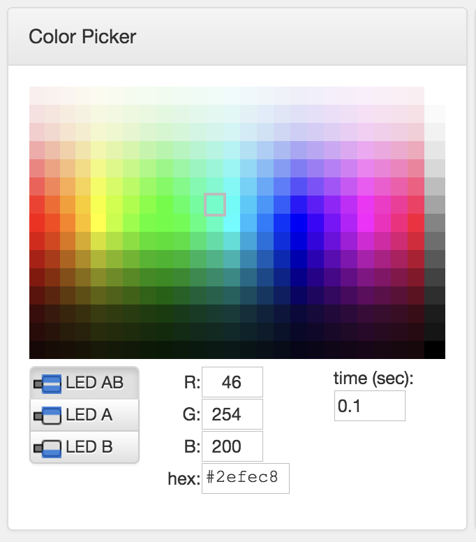

Click on any of the colors in the picker to select a new color. Or enter a specific color in the R,G,B text fields or a hex color string.

You can also pick which LED of the blink(1) to control (AB == both LEDs, A = top LED, B = bottom LED). When multiple blink(1) devices are plugged in, you can also select which blink(1) to address. The time field determines how long it will take to fade to that color.

## 7. Color Patterns

### 7.1 Patterns in General

Blink1Control2 ships with a collection of color patterns and you can create your own.

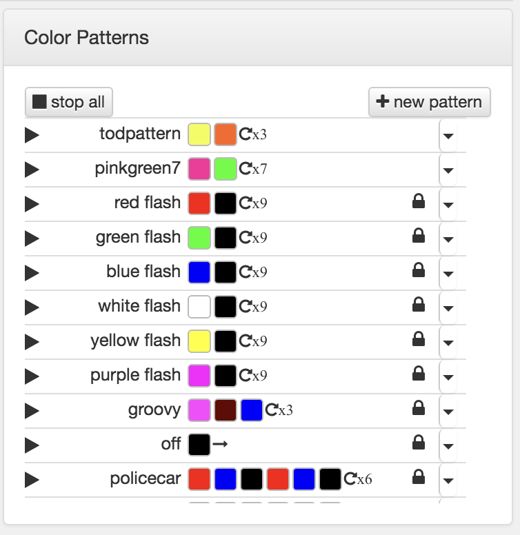

A color pattern is list of colors, where each color contains a time duration and which LED (A, B, or both AB) to be that color. A color pattern also contains a number of times to repeat. The repeat symbols have the following meaning:

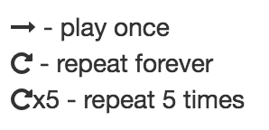

To try out a pattern, click on the triangular play button to the left of the pattern name. The pattern will start playing and the play button turns into a rectangular stop button.

### 7.2 Editing Patterns

The patterns that come with Blink1Control2 are read-only and cannot be edited. However, they can be copied and edited. To copy or edit a pattern, click on the right-hand arrow next to the pattern in question and pick an option from the drop-down menu.

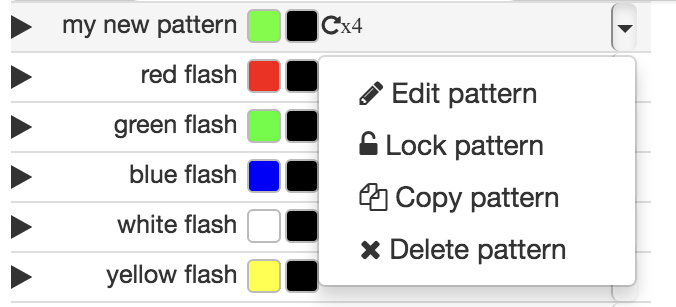

To edit a pattern, choose "Edit pattern" from the drop-down menu. Now the pattern line will change and you can inline-edit the name, add more colors to the pattern (based on the current setting in the Color Picker).

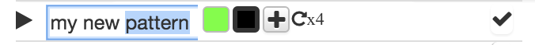

To delete or change an existing color, click on its color spot. The Color Picker will change to reflect that color and any changes made in the Color Picker will be reflected in the color spot. When done, click the right-hand checkmark to finish editing.

### 7.3 Meta-patterns

The URL, Script, and File event sources (and the API server) can specify an existing pattern name or a "meta-pattern". A meta-pattern is a special pattern name that is actually a command into Blink1Control2 for on-the-fly creation of new temporary color patterns.

Allowed meta-patterns:

- `#hexcolor` — turn to a hex color
  - e.g. `#ff0033`
- `~blink:{color}-{count}` — blink on/off a color the specified number of times
  - e.g. `~blink:red-3`
  - e.g. `~blink:#ff00ff-5`
- `~blink:{color}-{count}-{on/off time}` — blink on/off with a blink time duration
  - e.g. `~blink:white-3-0.2`
- `~pattern:{name}:{patternstring}` — create a new pattern and play it
  - e.g. `~pattern:bob:3,#ff00ff,0.5,0,#00ff00,1.3,0`
  - e.g. `~pattern:good to go:1,#00f300,0.5,0,#000000,0.5,0`
- `~pattern-stop:{patternname}` — stop a currently playing pattern
  - e.g. `~pattern-stop:policecar`
- `~off` — stop all patterns and make all blink(1)s go dark

## 8. Event Sources

Events sources in Blink1Control generate events that result in color patterns playing. The event source most people will use is the free IFTTT service. You can have multiple event sources of the same type and Blink1Control ships with two demonstration IFTTT sources configured called "red demo" and "green demo".

To see a list of your configured event sources, click on the "Event Sources" tab.

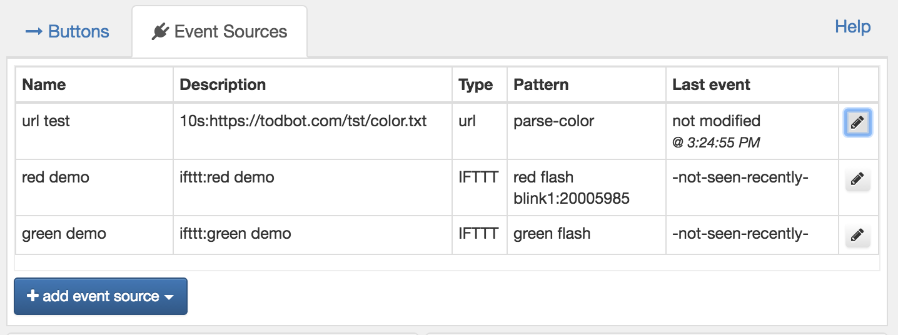

To edit an event source, double-click on it or click on the pencil icon to the right of it.

To create a new event source, click the **+ add event source** button and you'll be presented with the available event source types:

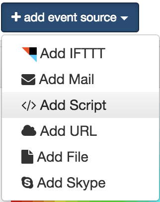

Choose the event source type and a dialog of options for that event source will open.

Every event source dialog will allow you to enable/disable the event source, rename it, delete it, or copy it.

### 8.1 IFTTT

The IFTTT event source is the simplest and only has two fields: Rule Name and Pattern. (If you have multiple blink(1)s, there is an optional third field of which blink(1) to use.) The Pattern is a list of the currently available color patterns, and is an option that is common to most every Event Source.

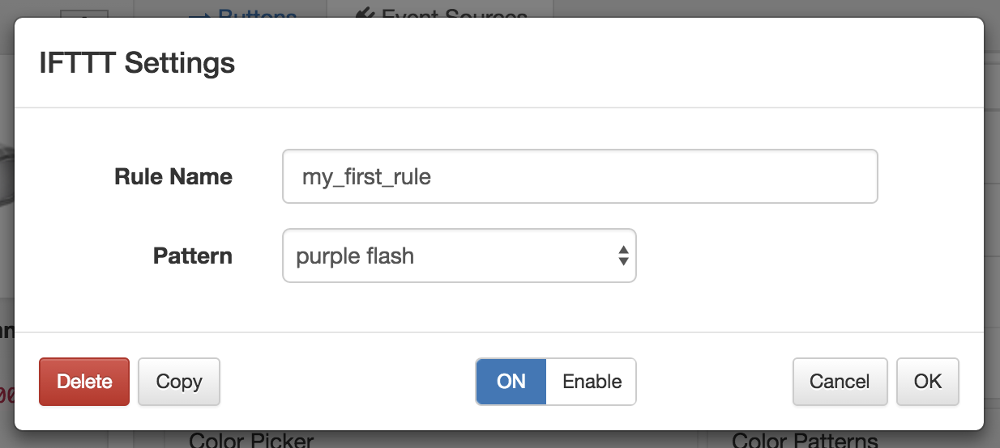

The Rule Name is a text field and should match what you have configured in your IFTTT recipe's action.

When you create a new recipe on IFTTT and configure the recipe's action, choose the blink(1) channel and its single action "Send blink event". This action has a single text field option called "Rule name". It is this field that must match the "Rule Name" in Blink1Control.

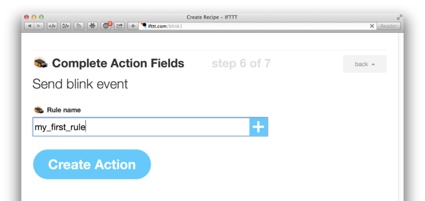

**Note:** Be sure to activate the blink(1) channel on IFTTT.

**Note:** When using multiple blink(1) devices with IFTTT, the IFTTT Key is based off of the first blink(1), but you can use IFTTT to trigger Event Sources bound to different blink(1) devices.

### 8.2 Email

The Email Event Source is one of the most complex because there are many different settings for email and many different ways to trigger off email events. Some users find the way IFTTT works with email easier, so that is always an option instead of using Blink1Control's built-in email support.

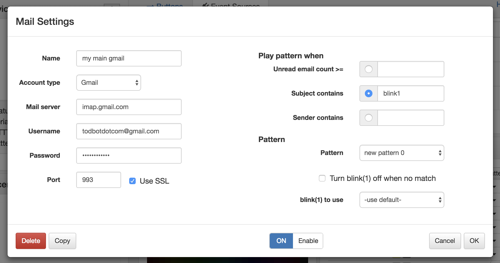

The Email settings dialog is divided into two halves: on the left is typical email login credentials info needed for any system that checks mail, on the right are settings on how to trigger on changes to your mail's state.

Email login credentials are stored encrypted on disk. Blink1Control2 only looks at email headers and it never issues any email commands that could delete mail. But if this is a delicate email account, we recommend not using it with Blink1Control2.

**Note:** Currently only IMAP and Gmail via IMAP are supported.

**Note:** Currently only the INBOX is monitored.

**Note:** For Gmail, you should configure two-factor authentication on your Google account and set up an "app password" just for Blink1Control2. This is good because then Blink1Control2 doesn't know your real password and you can revoke this app password whenever you want.

To create an app password:

1. Log into your Gmail account normally in your browser
2. Visit https://myaccount.google.com/u/1/security
3. Under "Signing into Google" click on "App Password" section
4. Under "Apps with access to your account" click on "MANAGE APPS"
5. Under "Select the app and device you want to generate the app password for", select app "MAIL" and device "Custom" and give it the name "Blink1Control2"
6. Click "GENERATE"
7. Use the resulting password as the IMAP/Gmail password in Blink1Control2, with your Gmail address as the username.

### 8.3 URLs, Scripts and Files

The dialog for URLs, Scripts and Files is almost identical, differing only in the source (Script path, File path, or URL) field.

In every case, you can choose how you want the output to be parsed. The **output as JSON** option looks for a JSON object with either a "pattern" key or a "color" key.

For more details on the output formats, see:
[https://github.com/todbot/blink1/blob/master/docs/blink1control-file-script-url-format.md](https://github.com/todbot/blink1/blob/master/docs/blink1control-file-script-url-format.md)

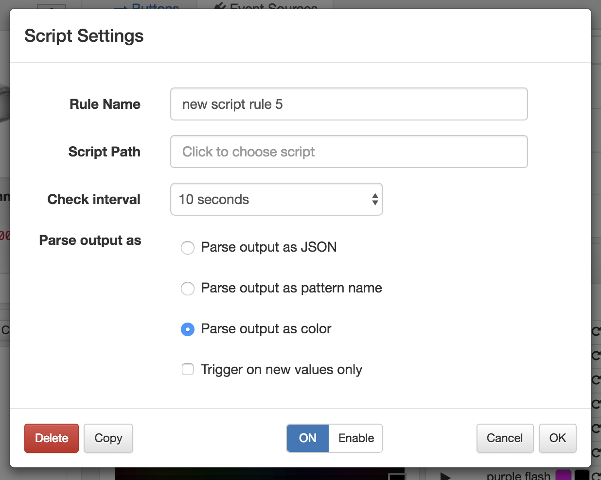


## 9. Recent Events

The Recent Events panel shows a timestamped text view of events created by event sources. It also shows when Big Buttons are pressed. This can help with time tracking.

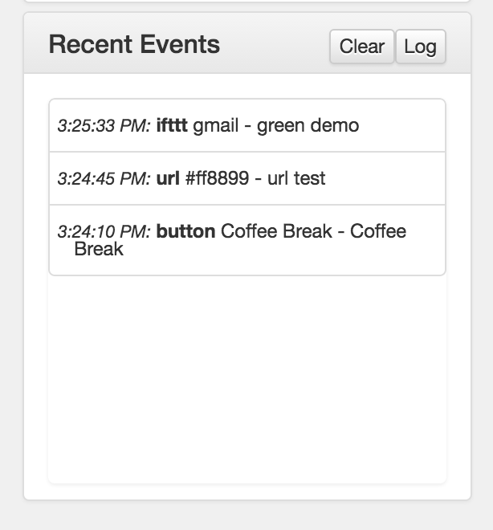

## 10. Tray Menu

Blink1Control2 has a Menu Bar icon on Mac OS X and a System Tray icon on Windows. Click (Mac) or right-click (Windows) on this icon to bring up a menu to manage Blink1Control2 without opening up its main window.

The tray menu is also primarily how you quit Blink1Control2, as closing the main window only hides it.

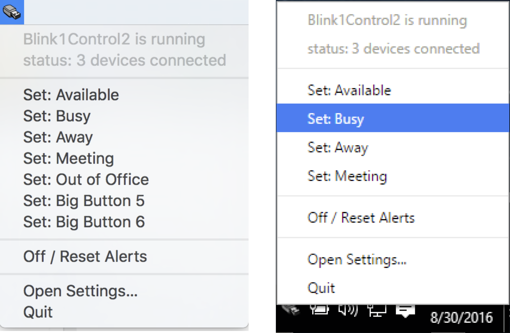

## 11. Preferences

From the gear icon above in the Device section or the Preferences menu option, you can open up the advanced Preferences window.

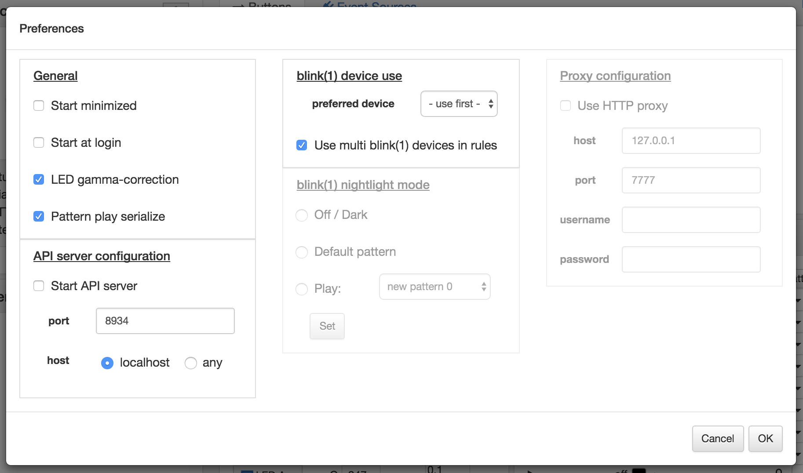

Most of these settings you will not need to modify (and some do not yet fully work).

### 11.1 Start minimized

When checked, this option will cause the application to not show any window on startup. It will still create a tray menu icon to let you open the window.

### 11.2 Start at login

When checked, this option will set the application to automatically start when the computer is restarted. On most systems, you will have to configure it to do automatic user login too.

### 11.3 Pattern play serialize

In previous versions of Blink1Control, multiple patterns could play simultaneously. This could be very confusing. With this option checked, a new event triggering a new pattern will cause the current pattern to pause, play this new pattern, then resume the previous pattern.

### 11.4 Start API server

Blink1Control2 has a full HTTP REST API. This option enables it. For details on the REST API see:

- [https://github.com/todbot/blink1/blob/master/docs/app-url-api-examples.md](https://github.com/todbot/blink1/blob/master/docs/app-url-api-examples.md)
- [https://github.com/todbot/blink1/blob/master/docs/app-url-api.md](https://github.com/todbot/blink1/blob/master/docs/app-url-api.md)

Some aspects of the API are not implemented yet by Blink1Control2.

### 11.5 Use multi blink(1) devices in rules

If multiple blink(1) devices are present and this option is checked, a new option will appear when configuring Event Sources to allow specifying a blink(1) device to be used.

## 12. Configuration file

The configuration file for Blink1Control contains the settings for color patterns, event sources, and preferences. This file is a JSON text file, editable by any text editor. The "About" window will give the path to this file.

Any login credentials are encrypted.

**Note:** If you edit this file, make sure Blink1Control2 is not running, or your edits may be over-written.

**Note:** If this file gets corrupted, it could prevent Blink1Control2 from starting up correctly. If you encounter this, try deleting the file and restarting. A fresh copy will be auto-generated.
